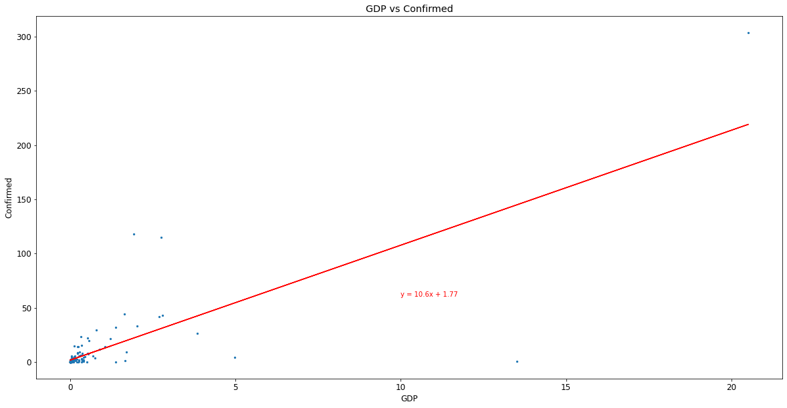

# Analysis: COVID-19 as it relates to Gross Domestic Product (GDP)

## Questions
1. Do countries with lower GDP have higher number of COVID-19 deaths?
1. Do countries with higher GDP have higher number of COVID-19 recoveries?
1. Does GDP have a relationship to COVID-19 confirmed cases?

## Hypotheses
1. Countries with lower GDP should have higher number of COVID-19 Deaths
1. Countries with higher GDP should have a higher number of COVID-19 Recoveries

## Observations
### COVID-19 by Geographic Regions
#### Confirmed Cases by Continent

North America has the largest number of confirmed cases, closely followed by Europe.

#### Confirmed Cases in North America

The United States appeared as an outlier in the North America region with the largest number of confirmed COVID cases verses all other countries.

#### Confirmed Cases in South America

Brazil is the outlier in the South America region with the largest confirmed COVID cases.

#### Confirmed Cases in Africa

South Africa is an outlier in the Africa region.

#### Confirmed Cases in Asia

India is an outlier in the Asia region. Point of interest with China has the very low number of confirmed cases given it is generally accepted as the point of origin for COVID-19.

#### Confirmed Cases in Europe

Europe has the most diverse counts of COVID confirmed cases.

#### Confirmed Cases in Oceanic

Not surprising that Australia has the largest number of confirmed cases given the size of the landmass verses the other island countries in the region.

### GDP in Relationship to COVID-19
There does not appear to be a correlation between a countries' GDP and number of COVID Deaths or Recoveries however there is a correlation between GDP and Confirmed COVID cases.

#### Relationship between GDP and COVID Deaths

The higher the GDP the more deaths occur within a country. This indicates that a countries’ GDP has no impact on the number of deaths from COVID-19.

#### Relationship between GDP and COVID Recovery

The higher the GDP the lower the number of recoveries.

#### Relationship between GDP and Confirmed Cases

There is a correlation between GDP and the number of COVID-19 confirmed cases. This was a surprising discovery given countries with higher GDP tend to have more resources, better healthcare, etc.

It is plausible to consider that because counties with higher GDP typically have a greater availablity of resources, the countries' populations may be more willing to take risks. This could warrant further study.

#### ANOVA: COVID Confirmed Cases in Geographic Regions
There is no significant difference between geographic regions based on COVID cases.
| Confirmed | Deaths | Recovered |
|:---|:---|:---|
|0.243|0.052|0.217|

#### ANOVA: Average GDP between Continents
p-value = 0.452498